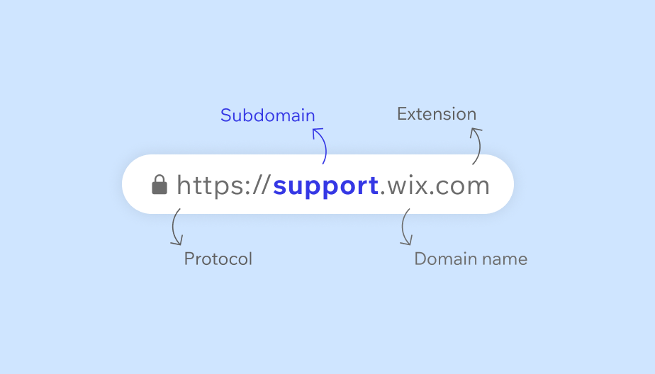

## Install
`git clone https://github.com/ismail4567/subfinder.git`
## Usage
`cd subfinder`    
`chmod+x Subfinder.sh`   
`./Subfinder.sh`
## Dependencies
### Assetfinder
`sudo apt install assetfinder`    
See more about assetfinder [click here.](https://www.kali.org/tools/assetfinder/)
### httprobe
`sudo apt install httprobe`    
See more about httprobe [click here.](https://www.kali.org/tools/httprobe/#:~:text=This%20package%20contains%20a%20tool,working%20http%20and%20https%20servers.)
# subfinder
### Subdomain
A subdomain is a prefix added to a domain name to create a separate section of a website. Subdomains can be used to organize content, improve navigation, and support SEO. They can also be used to identify and separate different types of sites, such as mobile sites, location-specific sites, or sub-sections of a site.

  
> [!NOTE] 
> This Script is finding all the subdomains of a domain using **Assetfinder** and sorting alived subs using **httprobe**.
